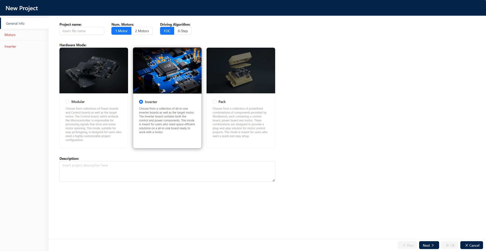
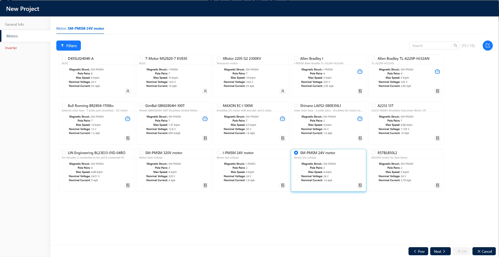
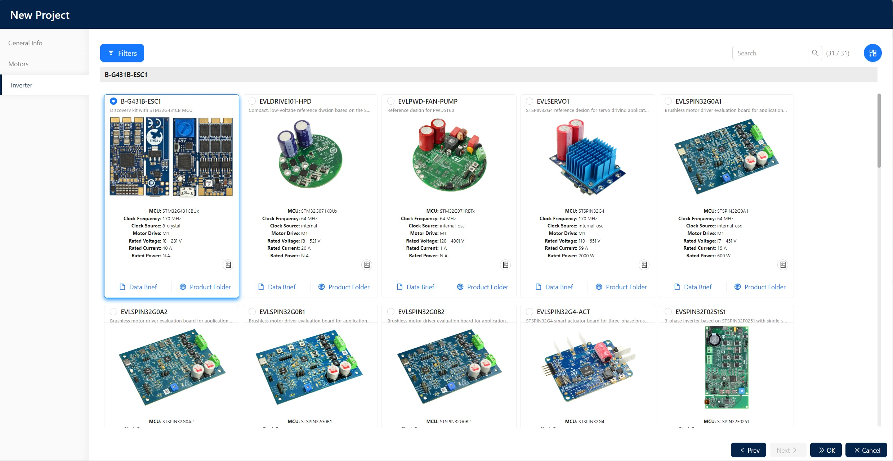
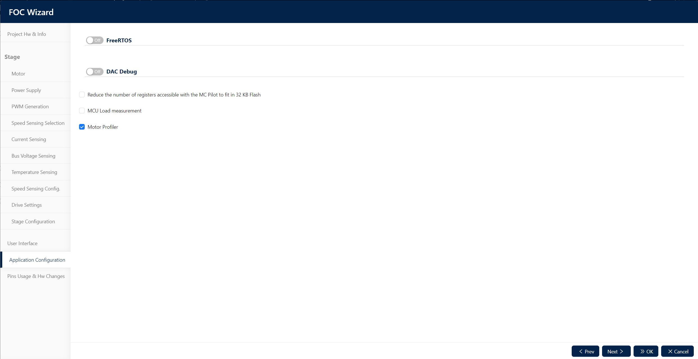
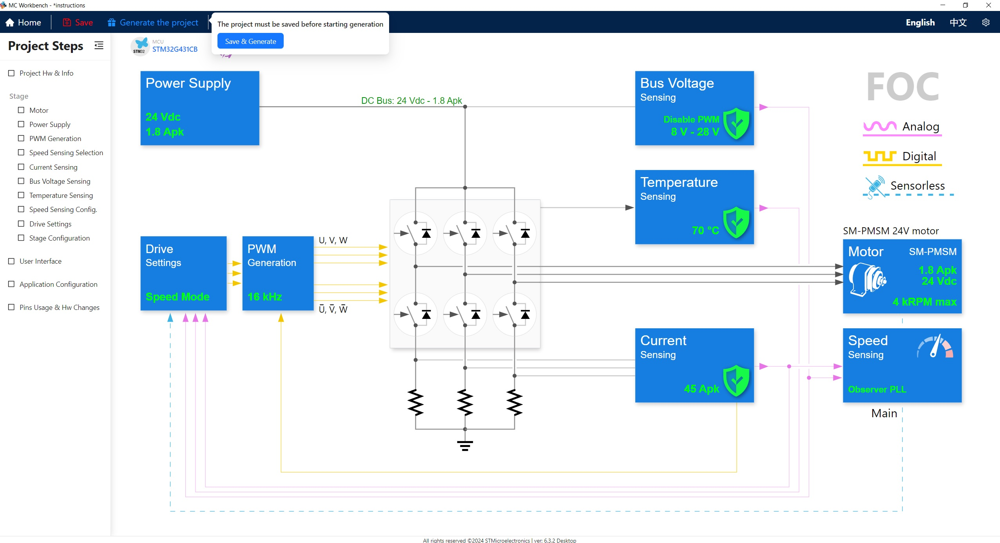
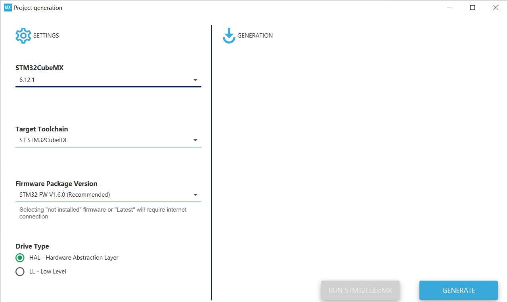
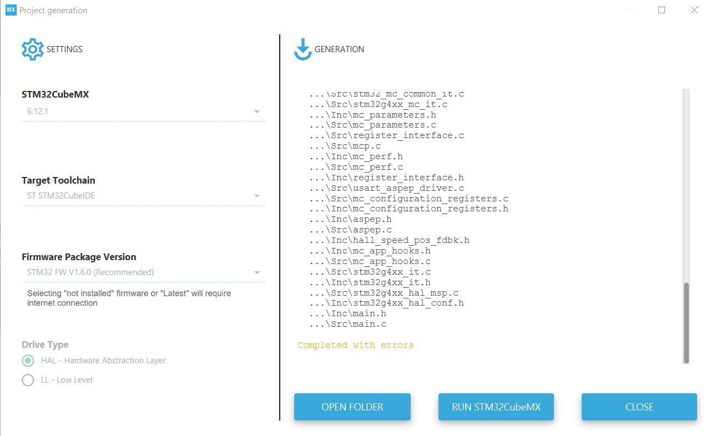
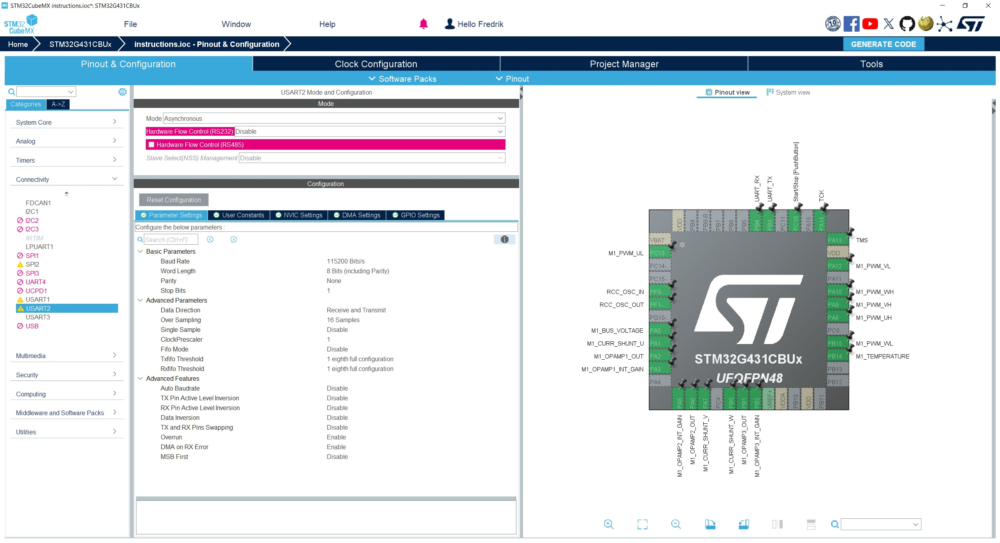
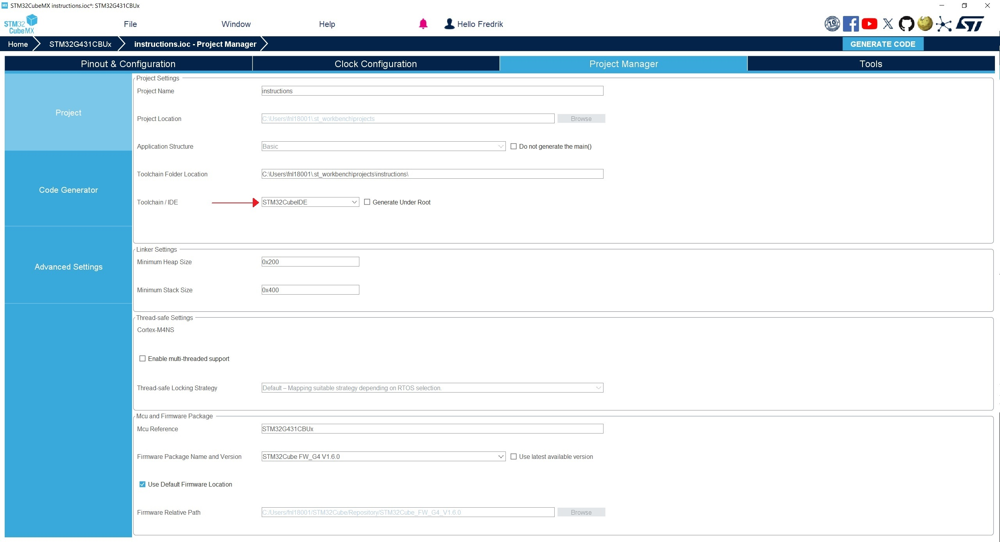

Field Oriented control (FOC)
=======================

DISCLAIMER
-----------------------
This code is DEPRICATED. It is incomplete and its only purpose is for future development.

When using the software provided by STM which supports their MCUs a lot of functions and libraries are generated. We have not been able to exclude the libraries generated that isn't necessary for the code to run. In this repo, the team have elected to only upload the main.c file which is the only file that has been changed by the developers. Later in this **README** there is a step-by-step instruction on what the team did in respective software so that those could generate the files. However, there is no way the team could ensure that even though a future user follows the steps provided in the **README** will generate the same files due to the fact that STM might not support the version the team have used in the future, or if STM elects to generate another code using a different library.

About
-----------------------
This repository contains the code running on the ESC for controlling the wheel motors using FOC.

## Built with
The following tools were used to generate and modify the code for FOC:
- [STM32CubeIDE 1.16.1](https://www.st.com/en/development-tools/stm32cubeide.html)
- [STM32CubeMX 6.12.1](https://www.st.com/en/development-tools/stm32cubemx.html)
- [MC Workbench 6](https://wiki.st.com/stm32mcu/wiki/STM32MotorControl:STM32_MC_Workbench) (Only available for Windows.)


Getting started
-----------------------

### Prerequisites

To retrace the steps the students made during the autumn semester of 2024 the hardware componentes below you will need in addtion to the software listed above. Also, you will need a power source and cables which you can solder onto the inverter and motor.

### Hardware
1. [Nanotec DF45L024048-A](https://www.nanotec.com/eu/en/products/1786-df45l024048-a)
2. [Electronic Speed Controller Discovery kit for drones with STM32G431CB B-G431B-ESC1](https://www.mouser.se/ProductDetail/511-B-G431B-ESC1)


### Installation
1. Clone the repository:
```
git clone https://github.com/DVA490-474-Project-Course/foc_code.git
```
2. Download and install STM32CubeIDE 1.16.1, STM32CubeMX 6.12, STM32 Motor Control Software Development Kit (please see ## Built with)

### Step-by-step configuration
1. In the MC Workbench, create a new project.
    1. Under 'General Info' select
        1. Project name 
        2. Num. Motors: 1 Motor
        3. Driving Algorithm: FOC
        4. Inverter
        5. Please see the image for a visual explanation
        6. 
        

    2. Under *Motors* select a motor that is similar to the Nanotec DF45L024048-A
        1. 
    4. Under the *Inverter* tab select B-G431B-ESC1
        1. 
    5. Once you've completed all the steps above click ok
2. In the next window called *Project Steps* select the *Application Configuration* tab, check the box for 'Motor Profiler' and click ok
    1. 
3. Click Generate the project - you will be asked to save the project as well.
    1. 
4. A pop-up window will emerge, make sure that all the settings are the same as in the image below (in the extent that it is possible).
    1. 
    2. Once it has completed click 'RUN STM32CubeMX'
    3. 
5. Once STM32CubeMX has launched go to the 'Pinout & Configuration' tab and select connectivity. Make sure that the settings for USART2 are the same as in the picture below.
    1. 
6. Go to 'Project Manager' and in the first tab 'Project' make sure that the option 'Toolchain / IDE' is set to STM32CubeIDE, as seen in the picture (and highlighted with a red arrow).
    1. 

-----------------------

Roadmap
-----------------------
- [ ] Establish a connection using UART
- [x] Develop FOC

Design diagrams
-----------------------
Design diagrams/files can be found in the [docs](/docs) directory. Additionally 
they are available on:
- [Hardware Interface](https://www.mermaidchart.com/raw/11c442f5-192c-4ac3-b61e-867a3e2ca6ea?theme=dark&version=v0.1&format=svg)

License
-----------------------
A majority of the code is generated by the STM32CubeIDE and thus distributed under their License (see [liscense](/liscense.pdf)).

Contributors and contact
-----------------------
- Carl Larsson: cln20001@student.mdu.se
- Fredrik Westerbom
